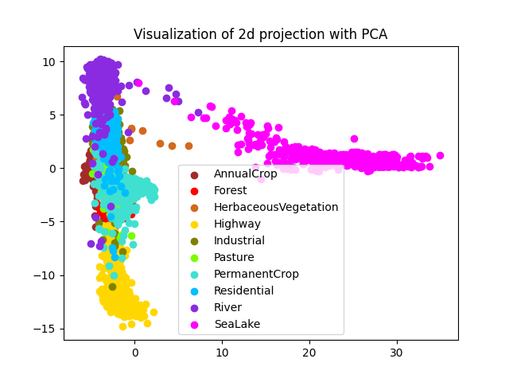
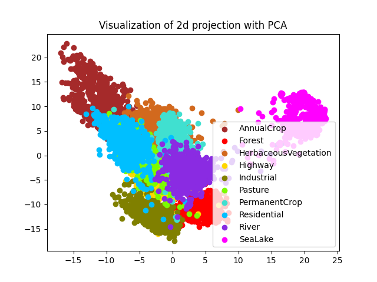
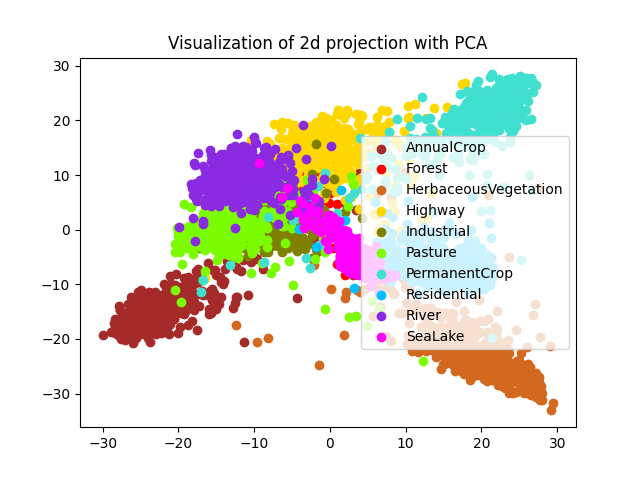
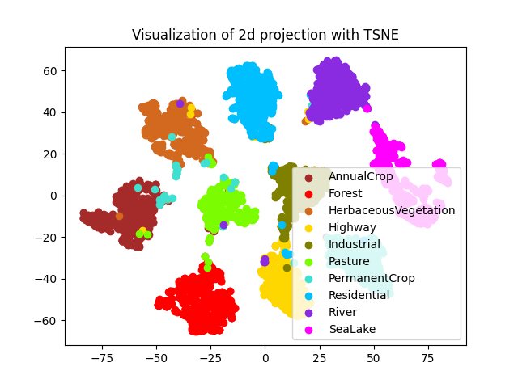
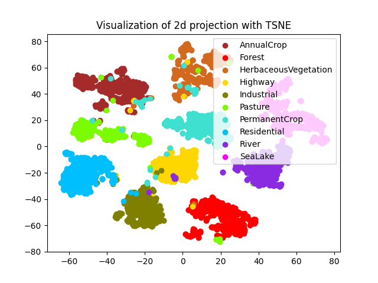
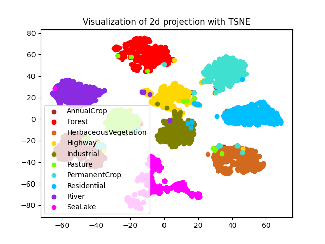

# EuroSAT Land Cover Classification

Benchmarking deep learning architectures for land use and land cover (LULC) classification on the [EuroSAT](https://arxiv.org/abs/1709.00029) Sentinel-2 dataset. All models are implemented from scratch in PyTorch.

## Repo Structure

```
.
├── data/               # Data folder
│   └── EuroSAT_MS.zip
├── Dataset/
│   ├── __init__.py
│   └── eurosat.py      # dataset class
├── Trainer/            # Base Trainer implementation and subclassese for each model (support for 
│   ├── __init__.py     # Training loop, checkpointing, logging)
│   ├── convnet_trainer.py
│   ├── resnet_trainer.py
│   ├── vit_trainer.py
│   └── swin_trainer.py
├── configs/            # training configuration files
│   ├── ...
│   ...
├── experiments/        # experiment tracking folder, handled by Trainer class 
│   └── EuroSAT-classification/   # project name
│       ├── experiment1/          # experiment name
│       │    ├── checkpoint_dir/  # model checkpoints
│       │    ├── logs/            # tensorboard logging
│       │    └── config.yml       # config file copy
│       ...
├── ConvNet/           # ConvNet Implementation
│   ├── model.py
│   ...
├── ResNet/            # ResNet Implementation
│   ├── model.py
│   ...
├── ViT/               # ViT Implementation
│   ├── model.py
│   ...
├── Swin/              # Swin Transformer Implementation
│   ├── model.py
│   ...
├── 2d_vis.py          # script for 2d visualization of model representations using PCA or TSNE
├── train.py           # entry point: python train.py --config configs/config.yml
└── test.py            # report test set metrics for a trained model: python test.py --config configs/config.yml 
```

## Setup

```bash
git clone https://github.com/chrispapa2000/eurosat-classification.git
cd eurosat-classification/
```
Install PyTorch:
```bash
pip install torch torchvision --index-url https://download.pytorch.org/whl/cu126
```

Install requirements:
```bash
pip install -r requirements.txt
```

Download the EuroSAT multispectral archive from the [official source](https://zenodo.org/records/7711810#.ZAm3k-zMKEA) and place it under the data root folder:

```
data/
└── EuroSAT_MS.zip
```


## Architectures

All implementations live under their respective folders and are built from basic PyTorch primitives.

| Model | Folder | Notes |
|---|---|---|
| ConvNet | `Convnet/` | Simple convolutional baseline — stacked conv blocks without skip connections |
| ResNet | `Resnet/` | Residual blocks with skip connections, batch norm, global average pooling |
| ViT | `ViT/` | Vision Transformer with patch embedding, multi-head self-attention, CLS token |
| Swin | `Swin/` | Swin Transformer with windowed attention (W-MSA) and shifted windowed attention (SW-MSA) |

ConvNet and ResNet share the same block structure — comparing them directly isolates the effect of residual connections. ViT and Swin share the transformer backbone but differ in attention scope (global vs. local windows).

---

## Dataset

The project uses the **EuroSAT Multispectral** dataset — 27,000 labeled 64×64 patches across 10 land cover classes, derived from Sentinel-2 imagery.

**Classes:** `AnnualCrop`, `Forest`, `HerbaceousVegetation`, `Highway`, `Industrial`, `Pasture`, `PermanentCrop`, `Residential`, `River`, `SeaLake`

Images are GeoTIFFs with 13 spectral bands. The dataset class applies per-band z-score normalization using precomputed statistics from the training split.

## Training

```bash
python train.py --config configs/config.yml
```

All model/training parameters can be specified in a single config file (see `configs/` folder for examples). The `BaseTrainer` handles the training loop, validation, checkpointing, and experiment tracking. Model-specific subclasses under `Trainer/` override the `build_model()` method to return the specified model.

Trainers are adapted from my [ViT-classification](https://github.com/chrispapa2000/ViT-classification) project.


## Representation Visualisation

`2d_vis.py` generates PCA and t-SNE plots of learned representations for any trained model.

```bash
python 2d_vis.py --config experiments/EuroSAT-classification/exp1-swin/config.yml
```

**Feature extraction per model:**

- **ViT** — CLS token embedding, extracted right before the projection head
- **Swin / ResNet / ConvNet** — final feature map, spatially averaged via global average pooling

This means all models produce a flat feature vector of the same shape, making the visualisations comparable across architectures.

## Results

### Results on Test Set

| Model | Params | Epoch-Time | Acc@1 | Acc@3 |
|---|---|---|---|---|
|ConvNet|26M|12s|0.6135|0.8852|
|ResNet|26M|12s|0.9778 |0.9987|
|ViT|5.4M|70s|0.9767|0.9983|
|Swin|6.9M|33s|0.9774|0.9976|

### PCA Embedding visualization

|  Model |                        Visualization                        |
|:------:|:-----------------------------------------------------------:|
| ResNet |  \| |
|   ViT  |   \|   |
|  Swin  |   \|  |

### t-SNE Embedding visualization

|  Model |                        Visualization                        |
|:------:|:-----------------------------------------------------------:|
| ResNet | \| |
|   ViT  |   \|  |
|  Swin  |      |


All experiments where run on an NVIDIA RTX 3060 laptop GPU with 6GB for vRAM.


## References

- Eurosat: [EuroSAT: A Novel Dataset and Deep Learning Benchmark for Land Use and Land Cover Classification](https://arxiv.org/pdf/1709.00029)
- ResNet: [Deep Residual Learning for Image Recognition](https://arxiv.org/pdf/1512.03385)
- ViT: [An Image is Worth 16x16 Words: Transformers for Image Recognition at Scale](https://arxiv.org/pdf/2010.11929)
- Swin Transformer: [Swin Transformer: Hierarchical Vision Transformer using Shifted Windows](https://arxiv.org/pdf/2103.14030)
